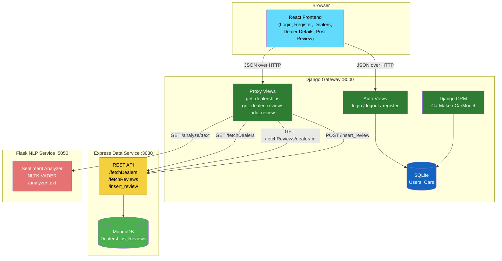
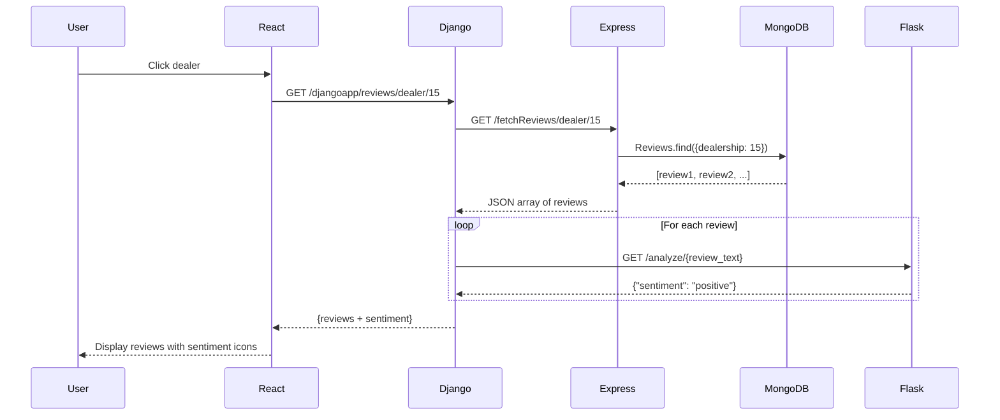
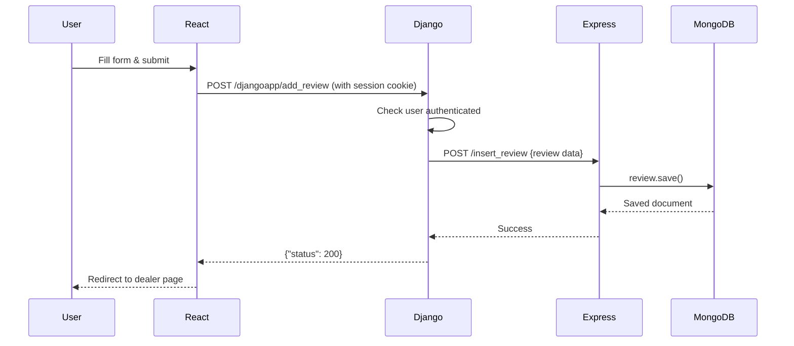

# Service Architecture & Data Flow

### Service Diagram

```mermaid
graph TB
    subgraph "Browser"
        UI["React Frontend<br/>(Login, Register, Dealers,<br/>Dealer Details, Post Review)"]
    end

    subgraph "Django Gateway :8000"
        AUTH["Auth Views<br/>login / logout / register"]
        PROXY["Proxy Views<br/>get_dealerships<br/>get_dealer_reviews<br/>add_review"]
        MODELS["Django ORM<br/>CarMake / CarModel"]
        SQLite[("SQLite<br/>Users, Cars")]
    end

    subgraph "Express Data Service :3030"
        API["REST API<br/>/fetchDealers<br/>/fetchReviews<br/>/insert_review"]
        MongoDB[("MongoDB<br/>Dealerships, Reviews")]
    end

    subgraph "Flask NLP Service :5050"
        NLP["Sentiment Analyzer<br/>NLTK VADER<br/>/analyze/:text"]
    end

    UI -->|"JSON over HTTP"| AUTH
    UI -->|"JSON over HTTP"| PROXY
    AUTH --> SQLite
    MODELS --> SQLite
    PROXY -->|"GET /fetchDealers"| API
    PROXY -->|"GET /fetchReviews/dealer/:id"| API
    PROXY -->|"POST /insert_review"| API
    PROXY -->|"GET /analyze/:text"| NLP
    API --> MongoDB

    style UI fill:#61dafb,color:#000
    style AUTH fill:#2e7d32,color:#fff
    style PROXY fill:#2e7d32,color:#fff
    style MODELS fill:#2e7d32,color:#fff
    style SQLite fill:#1565c0,color:#fff
    style API fill:#f4d03f,color:#000
    style MongoDB fill:#4caf50,color:#fff
    style NLP fill:#e57373,color:#fff
```

### Data Flow: Viewing Dealer Reviews

```mermaid
sequenceDiagram
    participant User
    participant React
    participant Django
    participant Express
    participant MongoDB
    participant Flask

    User->>React: Click dealer #15
    React->>Django: GET /djangoapp/reviews/dealer/15
    Django->>Express: GET /fetchReviews/dealer/15
    Express->>MongoDB: Reviews.find({dealership: 15})
    MongoDB-->>Express: [review1, review2, ...]
    Express-->>Django: JSON array of reviews
    loop For each review
        Django->>Flask: GET /analyze/{review_text}
        Flask-->>Django: {"sentiment": "positive"}
    end
    Django-->>React: {reviews + sentiment}
    React-->>User: Display reviews with sentiment icons
```

### Data Flow: Posting a Review

```mermaid
sequenceDiagram
    participant User
    participant React
    participant Django
    participant Express
    participant MongoDB

    User->>React: Fill form & submit
    React->>Django: POST /djangoapp/add_review (with session cookie)
    Django->>Django: Check user authenticated
    Django->>Express: POST /insert_review {review data}
    Express->>MongoDB: review.save()
    MongoDB-->>Express: Saved document
    Express-->>Django: Success
    Django-->>React: {"status": 200}
    React-->>User: Redirect to dealer page
```
