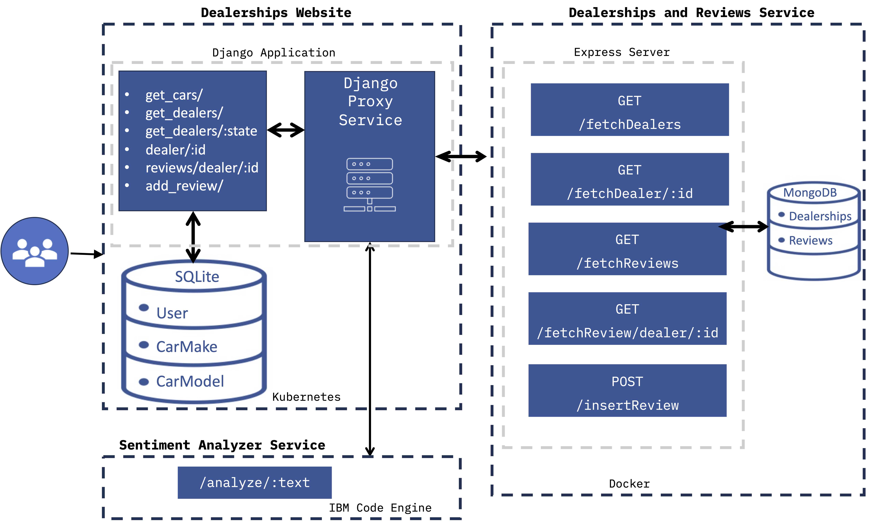

# fullstack_developer_capstone

## Part 1: Frontend Design with Django

- Set up a Python **virtual environment** (`djangoenv`) to isolate project dependencies
- Installed all required packages from `requirements.txt` using pip
- Ran `makemigrations` and `migrate` to initialize the **SQLite database**
- Project follows a standard Django structure with `djangoproj` (config) and `djangoapp` (application logic)
- Created static **HTML** pages styled with **Bootstrap** and custom **CSS**
- Built three main pages:
  - **Home** — landing page for the dealership
  - **About Us** — displays team member cards with roles and contact info
  - **Contact Us** — features a dealership banner, support icon, and contact details
- **Django** handles **URL routing** through `urls.py` to link pages together
- Static assets (images, CSS, Bootstrap) served through Django's **static files** system
- A **React app** structure (`frontend/src`, `frontend/public`) is in place for future dynamic UI development
- Overall goal: establish the **project setup, page layout, styling, and navigation** as the static foundation for later parts

## Part 2: User Authentication
**Technologies used:** Python, Django, Django Auth, JavaScript, React, React Router, JSON, Bootstrap, SQLite

- Created a Django **superuser** for admin access and management
- Configured the React **frontend build** (`npm run build`) to compile into static files served by Django
- Implemented **three Django views** in `views.py`:
  - **`login_user`** — Authenticates user credentials using `django.contrib.auth.authenticate()` and creates a session
  - **`logout_request`** — Terminates the user session using `django.contrib.auth.logout()` and returns empty JSON
  - **`registration`** — Creates a new user account using Django's built-in `User` model
- Configured **Django URL routes** in `djangoapp/urls.py` for `/login`, `/logout`, and `/register` endpoints
- Built **React components** (`LoginPanel`, `RegisterPanel`) to provide the frontend UI for authentication
- Added **React routes** in `App.js` using `react-router-dom` to navigate between login and register pages
- Used **`@csrf_exempt`** decorator to allow JSON POST requests from the React frontend
- Communication between React and Django uses **JSON** (`JsonResponse` on backend, `json.loads()` for parsing)
- Updated **Django settings** to serve React's built static files
- Verified the complete **sign up → sign in → sign out** flow works end to end

## Part 3: Backend services:
### Node.js Mongo DB dockerized server
**Technologies Used:** Node.js, Express.js, MongoDB, Mongoose, Docker, IBM Code Engine, Django

- Developed a **Node.js backend application** using **Express.js** to provide RESTful API services.
- Connected the application to a **MongoDB database** using **Mongoose** for managing dealership and review data.
- Loaded initial data from **JSON files** into MongoDB collections.
- Implemented and tested API endpoints such as `/fetchReviews/dealer/:id`, `/fetchDealers`, and `/fetchDealers/:state`...
- Containerized the application using **Docker** for consistent deployment.
- Deployed the containerized backend on **IBM Code Engine** so the **Django application** can access the APIs.

### Django Models and Proxy Services
**Technologies Used:** Django, Python, React, REST APIs, Node.js, Express.js, MongoDB

- Created **CarMake** and **CarModel** data models in the Django application to represent car manufacturers and their vehicle models.
- Defined relationships between **car makes, car models, and dealerships**, including attributes such as model year, car type, and dealer ID.
- Registered the **CarMake** and **CarModel** models with the **Django admin site** to enable easy data management.
- Utilized **Express API endpoints backed by MongoDB** to retrieve dealership and review data.
- Implemented **Django views that act as proxy services**, allowing the Django application to request data from external APIs.

## Part 4: Dynamic Pages
**Technologies Used:** React, JavaScript, Django, REST APIs

- Developed the **frontend of the application using React** to display dealership and review information to users.
- Created a **Dealers component** to list all available dealerships retrieved from backend services.
- Implemented a **Dealer Details component** to display detailed information and customer reviews for a selected dealer.
- Built a **Review Submission page** that allows users to add and submit reviews for dealerships.
- Integrated the React frontend with the previously created **Django backend services and APIs** to fetch and display data dynamically.

## Part 4
### CI/CD:
**Technologies Used:** GitHub Actions, Git, Linting Tools
- Implemented **Continuous Integration (CI)** and **Continuous Delivery (CD)** to support collaboration among multiple developers.
- Ensured that all code pushed to the repository follows team coding standards and is free of syntax errors.
- Added an automated **linting workflow** that runs whenever code is pushed or a pull request is created.

